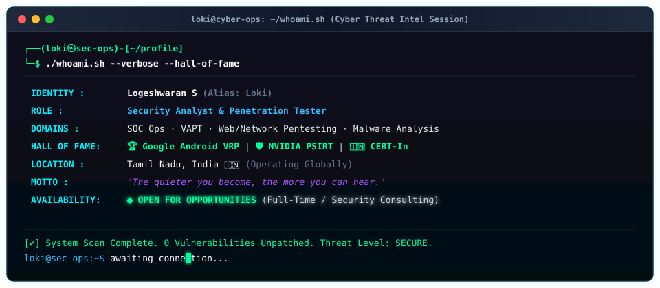

<!-- ═══════════════════════════════════════════════════════════════ -->
<!-- ███████████████ CYBER HUD ANIMATED HEADER ███████████████████ -->
<!-- ═══════════════════════════════════════════════════════════════ -->

  

<!-- DYNAMIC TYPING BANNER -->

 

<!-- LIVE STATUS BADGES ROW -->

  
  &nbsp;&nbsp;
  
  &nbsp;&nbsp;
  

 

---

 

<!-- ═══════════════════════════════════════════════════════════════ -->
<!-- ██████████████ SYSTEM TERMINAL (WHOAMI) ████████████████████ -->
<!-- ═══════════════════════════════════════════════════════════════ -->

### <g font-family="monospace">`❯ ./whoami.sh --verbose --hall-of-fame`</g>

 

---

 

<!-- ═══════════════════════════════════════════════════════════════ -->
<!-- ██████████████ HALL OF FAME & RECOGNITIONS █████████████████ -->
<!-- ═══════════════════════════════════════════════════════════════ -->

### <g font-family="monospace">`❯ ./wall-of-fame --list-bounties`</g>

<table width="100%">
  <tr>
    <td width="33%" align="center" valign="top" style="background:#090d16; border:1px solid #00ff9d; border-radius:8px; padding:15px;">
      <h3 align="center">🤖 Google Android VRP</h3>
      

      
<i>Acknowledged in Google Android Vulnerability Reward Program for reporting critical OS-level security flaws.</i>

    </td>
    <td width="33%" align="center" valign="top" style="background:#090d16; border:1px solid #7000ff; border-radius:8px; padding:15px;">
      <h3 align="center">👁️ NVIDIA PSIRT</h3>
      

      
<i>Honored by NVIDIA Product Security Incident Response Team for responsible vulnerability disclosures.</i>

    </td>
    <td width="33%" align="center" valign="top" style="background:#090d16; border:1px solid #00f0ff; border-radius:8px; padding:15px;">
      <h3 align="center">🇮🇳 CERT-In Honored</h3>
      

      
<i>Recognized by the Indian Computer Emergency Response Team (CERT-In) for national cyber defense contributions.</i>

    </td>
  </tr>
</table>

 

---

 

<!-- ═══════════════════════════════════════════════════════════════ -->
<!-- ██████████████ PROFICIENCY & SKILLS DASHBOARD ███████████████ -->
<!-- ═══════════════════════════════════════════════════════════════ -->

### <g font-family="monospace">`❯ ./skills --dashboard --visualize`</g>

  

<!-- CATEGORIZED CYBER ARSENAL & BADGES -->
<table width="100%">
<tr>
<td width="25%" align="center" valign="top">

#### 🛡️ SOC &amp; BLUE TEAM

</td>
<td width="25%" align="center" valign="top">

#### ⚔️ VAPT &amp; RED TEAM

</td>
<td width="25%" align="center" valign="top">

#### ⚙️ SEC ENGINEERING

</td>
<td width="25%" align="center" valign="top">

#### 🌐 THREAT INTEL

</td>
</tr>
</table>

 

---

 

<!-- ═══════════════════════════════════════════════════════════════ -->
<!-- ████████████ INTERACTIVE CYBER OPERATIONS MANUAL █████████████ -->
<!-- ═══════════════════════════════════════════════════════════════ -->

### <g font-family="monospace">`❯ ./ops_manual --interactive`</g>

<b>🛡️ Security Operations Center (SOC) &amp; Incident Response Playbooks</b> <i>(Click to Expand)</i>

 

- **Threat Detection &amp; Triage**: Specialized in analyzing SIEM alerts (Splunk ES & Sentinel), correlating multi-vector log sources, and filtering false positives.
- **Incident Response Lifecycle**: Experienced in containment, eradication, and root-cause post-mortem analysis adhering to NIST SP 800-61.
- **Threat Hunting**: Proactive hunting using IOCs, YARA rules, and anomaly detection across network traffic and endpoint telemetry.

<b>⚔️ Penetration Testing (VAPT) &amp; Bug Bounty Methodology</b> <i>(Click to Expand)</i>

 

- **Reconnaissance &amp; OSINT**: Deep attack surface mapping using Amass, Nmap, Sublist3r, and Google Dorking.
- **Vulnerability Assessment**: Deep dive into OWASP Top 10 vulnerabilities (SQLi, XSS, SSRF, IDOR, Business Logic Flaws).
- **Exploitation &amp; Reporting**: Authoring structured remediation advisory reports for developers & executive leadership.

 

---

 

<!-- ═══════════════════════════════════════════════════════════════ -->
<!-- ████████████ LIVE GITHUB COMMAND CENTER ANALYTICS ████████████ -->
<!-- ═══════════════════════════════════════════════════════════════ -->

### <g font-family="monospace">`❯ ./github_analytics --live`</g>

&nbsp;

  

&nbsp;

  

 

---

 

<!-- ═══════════════════════════════════════════════════════════════ -->
<!-- ██████████████ SNAKE CONTRIBUTION CANVAS ████████████████████ -->
<!-- ═══════════════════════════════════════════════════════════════ -->

### <g font-family="monospace">`❯ ./watch --contributions-matrix`</g>

<picture>
  <source media="(prefers-color-scheme: dark)" srcset="https://raw.githubusercontent.com/logesh-GIT001/logesh-GIT001/output/github-snake-dark.svg"/>
  <source media="(prefers-color-scheme: light)" srcset="https://raw.githubusercontent.com/logesh-GIT001/logesh-GIT001/output/github-snake.svg"/>
  
</picture>

 

---

 

<!-- ═══════════════════════════════════════════════════════════════ -->
<!-- ██████████████ CIPHER CONNECT & CHANNELS ████████████████████ -->
<!-- ═══════════════════════════════════════════════════════════════ -->

### <g font-family="monospace">`❯ ./connect --encrypted-channels`</g>

&nbsp;&nbsp;

&nbsp;&nbsp;

&nbsp;&nbsp;

&nbsp;&nbsp;

  

&nbsp;&nbsp;

&nbsp;&nbsp;

 

---

 

<!-- ═══════════════════════════════════════════════════════════════ -->
<!-- ██████████████ CYBER MATRIX ANIMATED FOOTER █████████████████ -->
<!-- ═══════════════════════════════════════════════════════════════ -->

  

